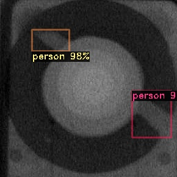

# Detectron2_Project

# faster rcnn train and test


faster rcnn test

- 


## INTRODUCTION

you have the trained model file from the libtorch(detectron2)


## windows10

- dependency : libtorch 1.6.0 , cuda 10.2 , cudnn 7.6.5  , opencv4.3.0 , vs2019 , YAML_CPP

- build:

    open Detectron2_Project.sln file 

    Detectron2_test.cpp : test 

    Detectron2_train.cpp : train

    


## Model and 3rdparty

YAML_CPP/opencv4.3.0/libtorch-1.6.0

## Train API

```c++
namespace Detectron2
{
	class Trainer {
	public:
		struct Options {
			std::string config_file					// path to config file
				= "configs/quick_schedules/mask_rcnn_R_50_FPN_inference_acc_test.yaml";
			bool webcam = false;
			std::vector<std::string> input;	
			CfgNode::OptionList opts;
			float confidence_threshold = 0.5;
		};
		static void start(const Options& options);

		static CfgNode setup_cfg(const std::string& config_file, const CfgNode::OptionList& opts,
			float confidence_threshold);

		void run_train();
	public:
		Trainer(const CfgNode& cfg, ColorMode instance_mode = ColorMode::kIMAGE, bool parallel = false);
	private:
		Metadata m_metadata;
		torch::Device m_cpu_device;
		ColorMode m_instance_mode;
		bool m_parallel;
		std::shared_ptr<TrainerBase> m_TrainerBase;
	};
}
```

## test API

```c++
namespace Detectron2
{
	class VisualizationDemo {
	public:
		struct Options {
			std::string config_file					// path to config file
				= "configs/quick_schedules/mask_rcnn_R_50_FPN_inference_acc_test.yaml";
			bool webcam = false;
			std::string video_input;
			std::vector<std::string> input;			
			std::string output;						
			CfgNode::OptionList opts;				
			float confidence_threshold = 0.5; 		
		};
		static void start(const Options &options);

		static CfgNode setup_cfg(const std::string &config_file, const CfgNode::OptionList &opts,
			float confidence_threshold);
	public:
		VisualizationDemo(const CfgNode &cfg, ColorMode instance_mode = ColorMode::kIMAGE, bool parallel = false);
		std::tuple<InstancesPtr, VisImage> run_on_image(torch::Tensor image);

		void run_on_video(cv::VideoCapture &video, std::function<bool(cv::Mat)> vis_frame_processor);

		void analyze_on_video(cv::VideoCapture &video, VideoAnalyzer &analyzer);

	private:
		Metadata m_metadata;
		torch::Device m_cpu_device;
		ColorMode m_instance_mode;
		bool m_parallel;
		std::shared_ptr<Predictor> m_predictor;
	};
}
```


## REFERENCE

https://github.com/LESSuseLESS/d2.git

## Contact


